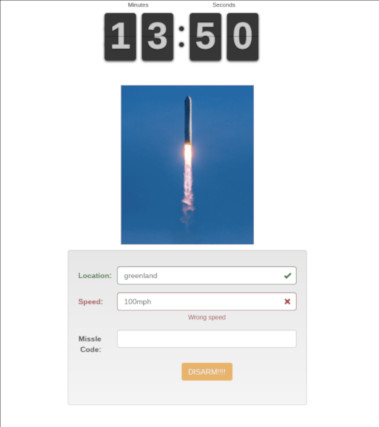

# PuzzleRoom
Escape room or puzzle room single page app

This is a single web page app created for the Cornell Elementary Advanced math group. 

## Installation 
To use simply clone or download the respository and open the index.html page in your web browser. Project the web page on a wall and enable your web browser's kiosk mode. 

## Description

A missile has been mistakenly launched. Only you and your team can stop it. Find the clues and enter the code to stop the missile. This is the result of the capstone project for my elementary advanced math group. I found this project to be interesting in that it required the team to be creative and work on a very open ended problem set. Many of my advanced kids found it hard to create something without any set parameters. 

The rest of the grade was able to go through the puzzle room and reinforce many of the years lessons. Course work was needed for about half of the puzzles. The other half were typical escape room challenges like magnet on a string, Velcro on a stick, air pressure tubing, UV lighting to find hidden words, riddles, and random tools. A large number of the puzzles used plastic storage boxes locked by a variety of combination locks. One side of a plastic container with two snap lids was sealed with epoxy and the other had holes drilled to insert locks. Tools or clues were stored inside to help with the next follow on puzzle. All puzzles were presented in a linear fashion to allow solving the entire room in about 15 minutes.

We used 4 separate problem flows. One to unlock the computer keyboard and three to enter into the web app. We were able to support about 15 kids split into teams to solve each problem flow in parallel. To keep it simple each problem flow was located on a separate row of tables. Kids really seemed to enjoy both building and running through the room. 

The problem presentation is in the Dr Z document. 

## Features:
* Simple setup
* Validation by regular expression
* Immediate feedback for each sub puzzle solved
* Feedback for failure and success
* Form caching disabled by appending random strings to form field names
* Large countdown timer
* Animated gifs

## Dependencies:
* flipclock.js
* Bootstrap
* Bootstrap-validator

## Custom fields are added in index.js with method addField
*  randomString is generated for you in the code
*  addField(fieldName, label, prompt, regex, errorMessage, randomString)
  
### Example:
*  addField("location", "Location:", "Please provide location",
            /^[ ]*greenland[ ]*$/i, "Wrong Location", randomString);
            
## Regular Expression Tutorial:
*    ^ - means start of string
*    [ ]* - means zero of more spaces
*    $ - means end of string
*    i - means letter case is not important
*    / - delimites the regular expression
